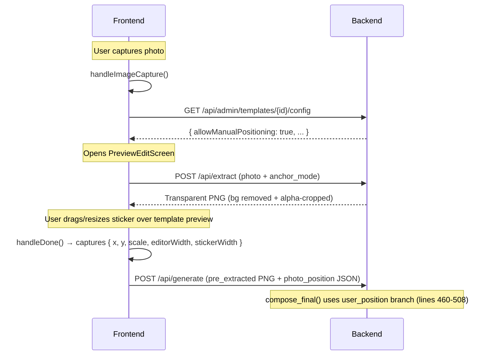

# Add Manual Sticker Positioning to WTM Mode

## Goal

Replicate the existing manual drag-and-resize sticker feature (used for standard sticker templates) into the WTM flow, so users can interactively position their cutout on top of the composed word template before final generation.

## How It Works Today (Standard Sticker Mode)

The existing manual positioning flow is a **4-step chain**:



### Key Components

| Component | File | Role |
|-----------|------|------|
| **PreviewEditScreen** | [PreviewEditScreen.tsx](file:///d:/work2/photo-booth/frontend/components/screens/PreviewEditScreen.tsx) | Full drag+pinch+slider UI. Shows template as background, extracted sticker as draggable overlay |
| **Template background** | Line 238 | Loads from `/api/admin/templates/{id}/image` — **this won't work for WTM** (WTM templates use composed cache PNGs) |
| **Extract endpoint** | [generate.py:L230](file:///d:/work2/photo-booth/backend/api/generate.py#L230) | `POST /api/extract` — removes bg, crops to alpha bbox, returns transparent PNG |
| **Position handling** | [compose.py:L460-508](file:///d:/work2/photo-booth/backend/services/compose.py#L460) | `user_position` branch in `compose_final()` — converts frontend px to backend canvas px |
| **Trigger logic** | [page.tsx:L244-254](file:///d:/work2/photo-booth/frontend/app/page.tsx#L244) | Checks `config.allowManualPositioning` from admin template config |

### What Needs to Change for WTM

The existing PreviewEditScreen loads the template background from `/api/admin/templates/{id}/image`. For WTM, the "template" is the **composed cache PNG** (base + words), not a standard admin template. So we need to:

1. **Tell PreviewEditScreen to use the composed template image URL** instead of the admin template image URL
2. **Route the WTM capture flow through the editing screen** instead of directly calling generate
3. **Pass `photo_position` to the WTM generate endpoint** and use it in `compose_final()`

## Proposed Changes

---

### Frontend

#### [MODIFY] [PreviewEditScreen.tsx](file:///d:/work2/photo-booth/frontend/components/screens/PreviewEditScreen.tsx)

Add support for a custom template image URL (for WTM composed templates):

- **New prop**: `templateImageUrl?: string` — when provided, use this URL for the background instead of fetching from `/api/admin/templates/{id}/image`
- **New prop**: `skipConfigFetch?: boolean` — when true, skip the config fetch (WTM templates don't exist in the admin config endpoint)

```diff
 interface PreviewEditScreenProps {
   selectedTemplate: string;
   rawImage: string;
   anchorMode?: string;
+  templateImageUrl?: string;    // Custom template image (e.g. WTM composed PNG)
+  skipConfigFetch?: boolean;    // Skip admin config fetch for WTM mode
   onComplete: (...) => void;
   onCancel: () => void;
 }
```

**Template background image source** (line 238):
```diff
-  src={`${API_BASE_URL}/api/admin/templates/${selectedTemplate}/image`}
+  src={templateImageUrl || `${API_BASE_URL}/api/admin/templates/${selectedTemplate}/image`}
```

**Config fetch** (lines 51-59): Skip when `skipConfigFetch` is true:
```diff
+  if (skipConfigFetch) {
+    // WTM mode: no admin config to fetch, just extract immediately
+    setTemplateConfig({ templateType: 'sticker' });
+    return;
+  }
   if (!templateConfig) {
     fetch(`${API_BASE_URL}/api/admin/templates/${selectedTemplate}/config`)
```

---

#### [MODIFY] [page.tsx](file:///d:/work2/photo-booth/frontend/app/page.tsx)

Route the WTM capture through PreviewEditScreen:

**1. `handleImageCapture` (lines 236-262)** — For WTM mode, go directly to the edit screen (don't try to fetch admin config):
```diff
   const handleImageCapture = useCallback(async (imageData: string) => {
     setError(null);
     if (!selectedTemplate) { ... }

+    // WTM mode: always use manual positioning
+    if (processingMode === 'word_template' && composedTemplatePath) {
+      setRawImage(imageData);
+      setTemplateConfig({ templateType: 'sticker', isWTM: true });
+      setIsEditing(true);
+      return;
+    }
+
     // Check if template permits interactive manual positioning
     try { ... }
```

**2. `handleEditComplete` (lines 264-268)** — Detect WTM mode and use the WTM generate endpoint:
```diff
   const handleEditComplete = useCallback((extractedBase64: string, position: any) => {
     setIsEditing(false);
-    executeGeneration(extractedBase64, "pre_extracted", position);
-  }, [selectedTemplate, processingMode]);
+    if (processingMode === 'word_template' && composedTemplatePath) {
+      executeGeneration(extractedBase64, "word_template", position);
+    } else {
+      executeGeneration(extractedBase64, "pre_extracted", position);
+    }
+  }, [selectedTemplate, processingMode, composedTemplatePath]);
```

**3. Render section (lines 342-350)** — Pass WTM-specific props to PreviewEditScreen:
```diff
   {isEditing && rawImage && templateConfig && (
     <PreviewEditScreen
       selectedTemplate={selectedTemplate}
       rawImage={rawImage}
       anchorMode={templateConfig.anchorMode}
       onComplete={handleEditComplete}
       onCancel={() => { setIsEditing(false); setRawImage(null); }}
+      templateImageUrl={
+        processingMode === 'word_template' && composedTemplatePath
+          ? `${API_BASE_URL}/api/wtm/composed-image?path=${encodeURIComponent(composedTemplatePath)}`
+          : undefined
+      }
+      skipConfigFetch={processingMode === 'word_template'}
     />
   )}
```

---

### Backend

#### [MODIFY] [wtm.py](file:///d:/work2/photo-booth/backend/api/wtm.py)

**1. Add a composed image serving endpoint** (new route):
```python
@router.get('/composed-image')
async def serve_composed_image(path: str):
    """Serve a composed WTM template PNG for frontend preview."""
    abs_path = os.path.abspath(path)
    if not os.path.exists(abs_path):
        raise HTTPException(status_code=404, detail='Composed template not found')
    return FileResponse(abs_path, media_type='image/png')
```

**2. Add `photo_position` form parameter** to the generate endpoint:
```diff
 async def wtm_generate(
     template_id: str = Form(...),
     composed_template_path: str = Form(...),
     photos: list[UploadFile] = File(...),
+    photo_position: str = Form(None),       # JSON from PreviewEditScreen
+    processing_mode: str = Form('sticker'),  # 'sticker' or 'pre_extracted'
 ):
```

**3. Pass `user_position` to `compose_final()`**:
```diff
+    user_position = None
+    if photo_position:
+        import json
+        try:
+            user_position = json.loads(photo_position)
+        except json.JSONDecodeError:
+            pass
+
     final_image = compose_service.compose_final(
         template_path=composed_template_path,
         stickers=stickers,
         template_meta=template_meta,
-        processing_mode='sticker',
+        processing_mode=processing_mode,
+        user_position=user_position,
     )
```

**4. Handle `pre_extracted` processing mode** — skip rembg if photo is already extracted:
```diff
+    if processing_mode == 'pre_extracted':
+        sticker_image = Image.open(BytesIO(photo_bytes)).convert("RGBA")
+        landmarks = None
+    else:
         sticker_image = await rembg_service.remove_background(photo_bytes)
         sticker_image = compose_service.crop_to_alpha_bbox(...)
         landmarks = face_service.detect_landmarks(sticker_image)
```

---

#### [MODIFY] [page.tsx `executeGeneration()`](file:///d:/work2/photo-booth/frontend/app/page.tsx#L169)

Pass `photo_position` in the WTM form data:
```diff
     if (isWTM) {
       formData.append('composed_template_path', composedTemplatePath!);
+      if (positionData) {
+        formData.append('photo_position', JSON.stringify(positionData));
+        formData.append('processing_mode', 'pre_extracted');
+      }
     }
```

## Summary of Changes

| File | Change |
|------|--------|
| `PreviewEditScreen.tsx` | Add `templateImageUrl` and `skipConfigFetch` props |
| `page.tsx` | Route WTM capture through edit screen; pass WTM props |
| `wtm.py` | Add `composed-image` endpoint; accept `photo_position` + `processing_mode` |
| `compose.py` | No changes needed — `user_position` branch already works |

## Verification Plan

### Manual Testing
1. Standard sticker with manual positioning → verify no regression
2. WTM flow → verify: words screen → capture → **edit screen shows composed template as background** → drag/resize sticker → generate → output contains both template and positioned sticker
